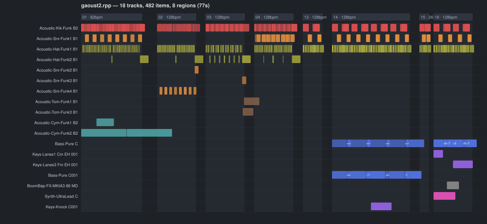
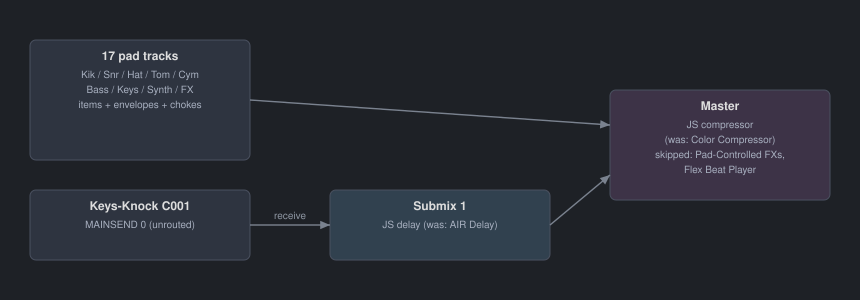

# mpc2rpp

Convert an **Akai MPC** project export (`.xpj` + `[ProjectData]` folder, as saved by
MPC 3 software / MPC Sample engine mode) into a native **REAPER** project (`.rpp`)
with the samples laid out on the timeline — no plugins, no MIDI mapping step,
just open the project and press play.

Every pad hit becomes an audio item at its exact position, so the result is
immediately editable: move hits around, stretch sections, swap samples, or
bounce stems.



*Visualization of a converted project (rendered from the actual conversion data):
one track per pad, one audio item per pad hit, item opacity = velocity,
regions = MPC sequences.*

## What gets converted

| MPC | REAPER |
|---|---|
| Pad with sample | Track named after the sample |
| Note event | Audio item at the note position (one-shot, full sample length) |
| Note velocity | Item gain |
| Sequence | Region (laid out back-to-back, one-bar gap) |
| Per-sequence BPM | Tempo marker at each region start |
| Pad level / pan (fader law `gain = 2v²`) | Track volume / pan |
| Pad fine tune | Item playrate (resample, like the MPC) |
| **16 Levels tuning** (per-note "Tuning (coarse)" modifier) | Item playrate, item named e.g. `Bass-Pure C +7st` |
| Recorded Q-link automation: pad level / pan | Track volume / pan envelope |
| Amp envelope attack / decay | Item fade-in / fade-out |
| Mute groups + monophonic pads | Items trimmed at the next choking hit (hat chokes work) |
| Master volume | Master fader |
| Submix routing + insert FX (`--with-effects`) | Bus track with receives, stock JS FX placeholders, notes naming the original MPC effects |

## Usage

Requires Python 3.8+ — no third-party dependencies.

```
python3 mpc2rpp.py MyProject.xpj
python3 mpc2rpp.py MyProject.xpj --with-effects
```

Expected input layout (what the MPC "save project" export produces):

```
MyProject.xpj                  <- gzipped ACVS/JSON project file
MyProject_[ProjectData]/       <- all referenced .wav samples
    Kick 1.wav
    Snare 3.wav
    ...
```

The output `MyProject.rpp` is written next to the `.xpj` and references the
samples with relative paths, so the folder stays portable. Open it in REAPER
(tested against the REAPER 7 project format) and press play.

Re-running the script regenerates the `.rpp` from scratch — it will overwrite
the previous output, so save your REAPER edits under a different filename.

## `--with-effects`

MPC insert-effect settings are stored as proprietary binary blobs that cannot
be translated, but the *topology* can be rebuilt:



- Pads routed to an MPC submix get their own bus track in REAPER (main send
  disabled, receive on the bus), with a stock JS delay inserted at defaults
  when the submix carried a delay.
- A stock JS compressor is placed on the master when the MPC main output
  carried a compressor.
- Track and project notes record the original MPC effect names so you know
  what to dial in.
- Performance-triggered effects (Pad-Controlled FXs, Flex Beat Player) are
  skipped — they are silent during normal playback — and noted in the
  project notes.

## Details and caveats

- **Timing**: MPC events are stored at 960 PPQ; positions are converted to
  seconds using each sequence's own BPM. Time signature is assumed 4/4.
- **One-shots**: pads in one-shot mode play the full sample regardless of the
  note length on the MPC, so items get the full sample length (then choke
  rules may trim them).
- **Chokes**: MPC drum pads default to monophonic, so a retrigger cuts the
  previous hit; pads sharing a mute group cut each other. Both are emulated
  by trimming item lengths with a 5 ms fade. This is usually the biggest
  audible difference vs. a naive conversion.
- **Amp envelopes**: MPC stores attack/decay normalized 0..1 with no
  documented time scale; they are approximated as a fraction of the sample
  length (decay only applies when the MPC's "decay from end" mode is set).
  A slow-attack pad becomes an item fade-in.
- **Tuning**: both per-pad fine tune and per-note 16 Levels tuning repitch by
  resampling (playrate change with preserve-pitch off), which is what the MPC
  itself does.
- **Automation**: pad-level and pad-pan Q-link recordings become track
  envelopes. Pad aftertouch is skipped when the program routes it to nothing;
  anything else unrecognized is skipped with a printed note, never silently.
- **No song mode support**: sequences are laid out in slot order. If your
  project uses Song mode, the arrangement order is not read (the projects
  this was built against had empty song lists).
- **Audio is untouched**: the converter never modifies or re-encodes the
  `.wav` files; the `.rpp` just references them.

## The `.xpj` format

The reverse-engineered notes on the MPC project format (container layout,
fader law, the 16 Levels modifier encoding, automation parameter IDs, routing
destinations) live in [docs/FORMAT.md](docs/FORMAT.md). If your project uses
a feature the converter skips, those notes are the place to start.

## License

MIT — see [LICENSE](LICENSE).
